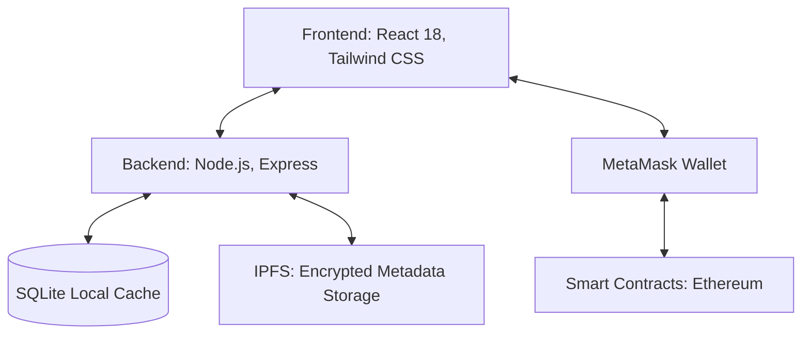

<div align="center">

# 🔐 CertiProof

**Next-Gen Decentralized Certificate Validation System**

[](https://opensource.org/licenses/MIT)
[](https://soliditylang.org/)
[](https://reactjs.org/)
[](https://nodejs.org/)
[](https://ipfs.io/)

[Explore Docs](#-api-documentation) · [Report Bug](https://github.com/yourusername/certiproof/issues) · [Request Feature](https://github.com/yourusername/certiproof/issues)

</div>

<hr />

## 📖 Overview

**CertiProof** is a production-ready Web3 dApp that solves the global problem of academic and professional certificate forgery. By combining the immutable ledger of **Ethereum** with the decentralized file storage of **IPFS**, CertiProof ensures trustless, instant verification of credentials without relying on centralized intermediaries.

- 🎓 **Issuers**: Universities, colleges, training providers, and certifying authorities.
- 👤 **Holders**: Students, professionals, and certificate owners.
- 🏢 **Verifiers**: Employers, background verification agencies, and institutions.

<hr />

## ✨ Premium Features

| Feature | Description |
| :--- | :--- |
| **🛡️ Tamper-Proof Security** | SHA-256 based document hashing. AES-256 encryption for metadata. On-chain records are permanently immutable. |
| **⚡ Instant, Trustless Verification** | Anyone with the original file can verify authenticity in seconds. No need to contact the issuing institution. |
| **🌐 Hybrid, Resilient Storage** | Primary metadata storage on IPFS with localized SQLite fallback for high availability and redundancy. |
| **🔗 Web3-Native Access Control** | Built-in MetaMask integration. Role-based access control (RBAC) via OpenZeppelin patterns for strict permissions. |

<hr />

## 🏗️ Architecture

CertiProof follows a modern N-tier, full-stack Web3 architecture separating UI, logic, blockchain, and decentralized storage.



- **Frontend**: React 18, Tailwind CSS, Ethers.js
- **Backend**: Node.js v20 LTS, Express, SQLite, Crypto (AES-256)
- **Blockchain**: Solidity 0.8.24, Hardhat, OpenZeppelin
- **Storage**: IPFS (Pinata/Local Node) + SQLite Cache
- **DevOps**: Docker-ready, Husky Hooks, GitHub Actions

<hr />

## 🚀 Quick Start (Local Setup)

Run the entire CertiProof system locally with just a few steps.

### 1. Installation

```bash
# Clone the repository
git clone https://github.com/yourusername/certiproof.git
cd certiproof

# Install dependencies for all workspaces
npm run install:all

# Configure Environment Variables
cp .env.example .env
```

### 2. Launch (One-Click)

**Windows Users:** Simply double-click `start.bat` in the project root, or run:
```bash
.\start.bat
```
*This script automatically spins up the local Hardhat node, deploys smart contracts, and boots both the Backend API and Frontend Dashboard.*

<hr />

## 📄 Smart Contract Core

The system is powered by `CertificateRegistry.sol`.

| Function | Access Level | Description |
| :--- | :--- | :--- |
| `issueCertificate` | **Issuer Only** | Creates a new certificate mapping `docHash` to the IPFS `cid`. |
| `verifyCertificate` | **Public** | Returns validity flag and associated on-chain metadata reference. |
| `revokeCertificate` | **Issuer Only** | Marks a certificate as revoked while preserving audit history. |

<hr />

## 🤝 Contributing

We welcome contributions to make CertiProof even better!

1. **Fork** the repository
2. **Create** your feature branch: `git checkout -b feature/amazing-feature`
3. **Commit** your changes: `git commit -m "Add amazing feature"`
4. **Push** to the branch: `git push origin feature/amazing-feature`
5. **Open** a Pull Request

<hr />

## 📜 License

Distributed under the **MIT License**. See the `LICENSE` file for more information.

<div align="center">

### Built with ❤️ by the CertiProof Team
*"Securing the future of credentials, one block at a time."*

⭐ **If you find this project useful, please consider giving it a star!** ⭐

</div>
